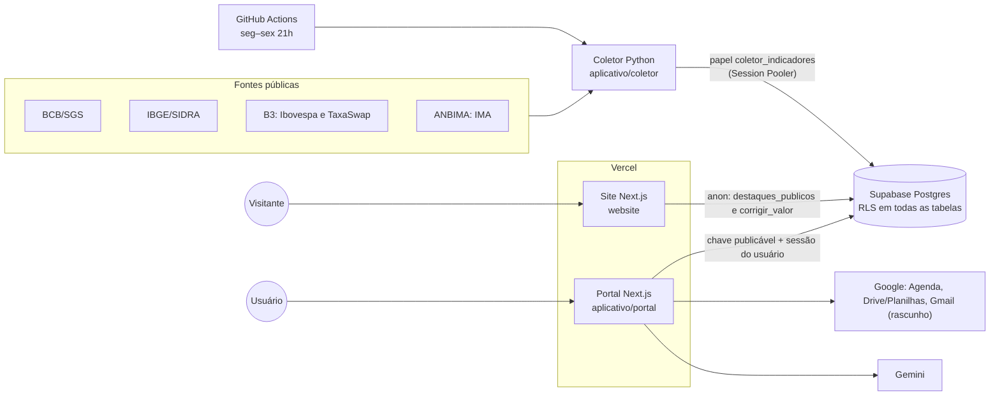

# Arquitetura



## Portal (`aplicativo/portal`)

Next.js 16 (App Router) e TypeScript. Sem Cache Components: todas as telas dependem da sessão e são dinâmicas.

```
src/
  app/            rotas, páginas, route handlers e server actions (finos: validam e chamam serviços)
  componentes/    UI, um componente por arquivo; "use client" só onde há interação
  dominio/        regras e cálculos puros, testados (retornos, projeções, insights, relatório, MIME)
  servicos/       acesso a Supabase, Google e Gemini; todos com `import "server-only"`
  proxy.ts        renova a sessão do Supabase e redireciona quem não está logado
```

- **Regra de negócio fica no domínio.** Os componentes só exibem. O gráfico de retornos usa o mesmo domínio no navegador para a seleção por arrasto, e o domínio não tem segredo nenhum.
- **Leitura de dados:**
  - funções de lote `series_valores` e `curvas_do_dia` (security invoker, então o RLS vale), porque a API REST limita cada consulta a 1.000 linhas;
  - o catálogo, os parâmetros e os feriados vêm direto das tabelas.
- **Gráficos:** Apache ECharts com registro modular (`componentes/graficos/echarts.ts`). As opções são montadas no servidor, e as funções de formatação ficam no cliente (`Grafico.tsx`).
- **Estilo:** CSS Modules com os tokens da identidade Perfin (`app/globals.css`): cantos retos, sem sombras, linhas de 1px.

## Dependências e por quê

| Pacote | Motivo |
|---|---|
| `@supabase/ssr`, `@supabase/supabase-js` | Cliente oficial; sessão por cookie no servidor |
| `zod` | Validação de variáveis de ambiente, filtros da URL e corpos de requisição |
| `echarts` | Zoom e arrasto do eixo, navegador e séries longas (amostragem LTTB), mapa de calor e faixas no mesmo pacote. Importado por módulo, só nas telas com gráfico |
| `server-only` | Impede que módulos com segredo entrem no bundle do navegador |
| `vitest`, Testing Library (dev) | Testes |
| `psycopg[binary]` (coletor) | Driver Postgres; o HTTP usa a biblioteca padrão |

**Sem SDK do Google nem do Gemini:** chamamos as APIs REST com `fetch` em wrappers pequenos (`servicos/google/*`, `servicos/assistente/gemini.ts`).

## Site (`website`)

Next.js estático, revalidado a cada hora. Usa apenas as funções públicas do banco. Veja [site.md](site.md).
